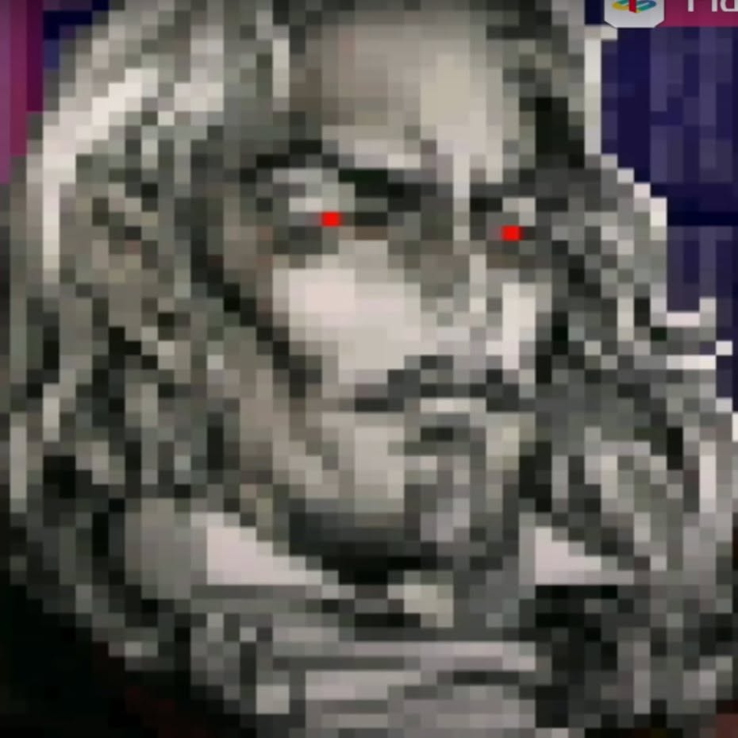
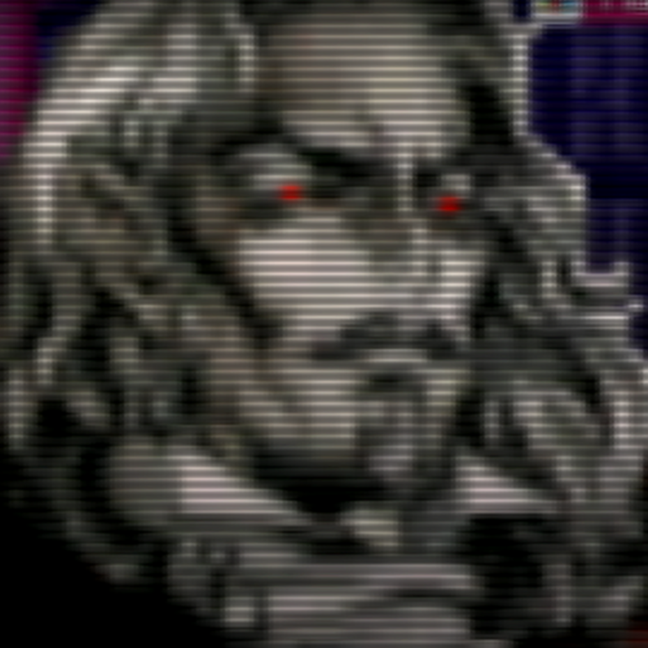

# CRT_emu_proposal

**RetroCRT Soft Auto** — a 3-pass [RetroArch](https://www.retroarch.com/) Slang shader preset ported from a custom WebGL CRT post-processing pipeline (`CRT_emu.html`).

It turns sharp pixel art (top) into the soft CRT look (bottom): 5x5 Gaussian softness, sine scanlines, mid-gray contrast, horizontal beam smoothing, detail/unsharp enhancement, final softening and automatic local tone restoration against the original frame.

| Input (`crt.jpg`) | Result (`result.png`) |
|---|---|
|  |  |

## Files

| File | Pass | Description |
|------|------|-------------|
| `retrocrt_soft.slang` | 0 | Soft CRT base: exact 5x5 Gaussian blur from the original shader (weights 0.003–0.159, radius scaled by blur amount, default 7.0), sine scanlines (`1 - strength^2 * sin(uv.y * freq * pi)`, strength 0.65, frequency 120), contrast around mid-gray (1.2), brightness (default 0.5 — the original renderer uses 0.4; tune to taste), horizontal beam spread driven by the scanline phase. |
| `retrocrt_finish.slang` | 1 | Post-processing: horizontal tent blur, 4-neighbour Laplacian detail enhancement, unsharp mask with threshold, 3x3 Gaussian softening, edge smoothing. |
| `retrocrt_tone.slang` | 2 | Automatic local tone match against the `Original` input: preserves source black point, mid-tones, local contrast and highlights. |
| `retrocrt_soft_auto.slangp` | — | Ready-to-load preset referencing the three passes with tuned defaults. |
| `CRT_emu.html` | — | Original WebGL + CPU pipeline this preset is ported from (reference). |

## Installation

Copy the four shader files (`*.slang`, `*.slangp`) into one folder inside your RetroArch `shaders` directory, then:

`Settings -> Video -> Shaders -> Load Shader Preset -> retrocrt_soft_auto.slangp`

All parameters (blur, scanline strength/frequency, contrast, brightness, detail, unsharp, smoothing, tone matching) are exposed as runtime shader parameters and can be tweaked live from the shader menu.

## Pixel-size behaviour

All spatial filters run in **source-pixel units** (`scale_type = source`, `scale = 1.0`), so blur, detail and smoothing thickness track the game's native pixel grid. The result is then scaled to the viewport (`scale_type2 = viewport`). Scanline frequency is defined in normalized UV space (`sin(uv.y * 120 * pi)`), exactly like the original renderer, so the scanline count follows the picture height.

## Differences vs. the original WebGL pipeline

- The original applies a per-row "scanline removal" brightness correction on the CPU (full-frame reduction). The port replaces it with per-pixel local tone matching against the original frame (pass 2), which preserves black/white handling without a histogram pass.
- `brightness` defaults to **0.5** (the original used a global 0.4 pre-darkening, later partially compensated by the scanline-removal step); 0.4–0.5 both reproduce the target look.
- Detail enhancement, unsharp mask and softening are 4-neighbour / 3x3 approximations of the original 8-neighbour CPU filters.
- `applySubpixelization` from the original is omitted on purpose: the pipeline calls it with subpixel size 1, which is a no-op.

## Validation

All shaders compile cleanly with `glslangValidator -V` (Vulkan semantics, `#version 450`).
